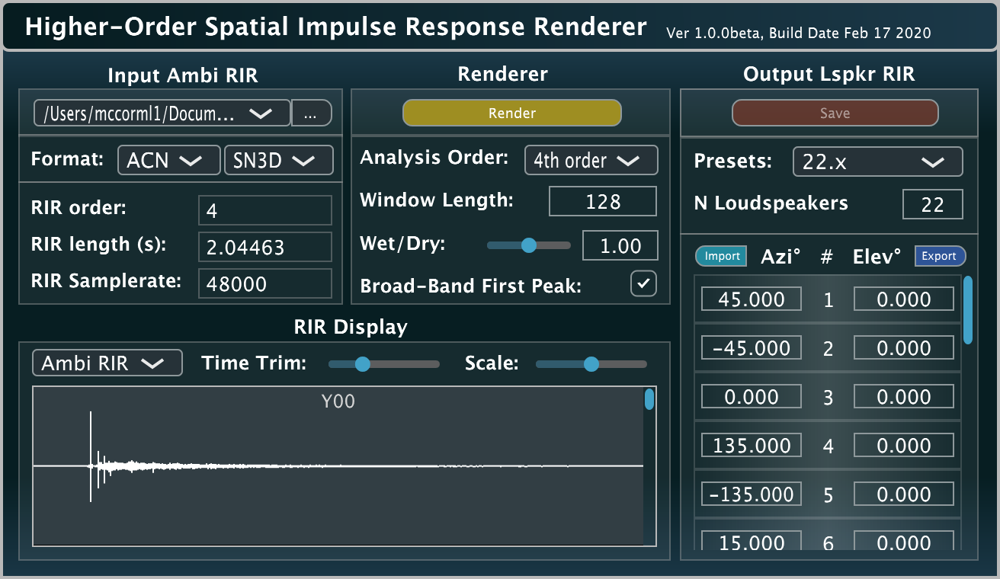

# HO-SIRR-GUI

Higher-order Spatial Impulse Response Rendering (HO-SIRR) is a rendering method [1], which can synthesise output loudspeaker array room impulse responses (RIRs) using input spherical harmonic (Ambisonic/B-Format) RIRs of arbitrary order. The method makes assumptions regarding the composition of the sound-field and extracts spatial parameters over time, which allows it to map the input to the output in an adaptive and more informed manner; when compared to linear methods such as Ambisonics.

The idea is that you then convolve a monophonic source with this loudspeaker array RIR, and it will be reproduced and exhibit all of the spatial characteristics of the captured space.



* [1]  McCormack, L., Politis, A., Scheuregger, O., and Pulkki, V. (2019). **"Higher-order processing of spatial impulse responses"**.
In Proceedings of the 23rd International Congress on Acoustics, 9--13 September 2019 in Aachen, Germany.

## Pre-built plug-in and App

The plug-in and App may be downloaded from [here](http://research.spa.aalto.fi/projects/sparta_vsts/) [Mac OSX (10.10 or higher), Linux (x86_64), and Windows (64-bit)].

## Building the plug-in and App yourself

First clone the repository (including submodules) with:

```
git clone --recursive https://github.com/leomccormack/HO-SIRR-GUI
# or if you have already cloned the repository, update with:
git submodule update --init --recursive
git pull --recurse-submodules
```

## Prerequisites 

The JUCE [modules](https://github.com/WeAreROLI/JUCE/releases) and [VST2_SDK](https://web.archive.org/web/20181016150224/https://download.steinberg.net/sdk_downloads/vstsdk3610_11_06_2018_build_37.zip), must be placed in the 'SDKs' folder like so:

```
SDKs/modules 
SDKs/VST2_SDK
```

**MacOSX, Windows and Linux (x86_64/amd64) versions**: also require a custom Intel MKL library. Details on how to acquire this library may be found [here](https://github.com/leomccormack/Spatial_Audio_Framework/blob/master/CUSTOM_INTEL_MKL_INTRUCTIONS.md). 

**Raspberry Pi (ARM) versions** instead require OpenBLAS and LAPACKE libraries:

```
sudo apt-get update
sudo apt-get install liblapack3 liblapack-dev libopenblas-base libopenblas-dev liblapacke-dev
```

**Linux (amd64/ARM) users** must also install the following libraries (the former line for JUCE, the latter line for the Spatial_Audio_Framework):

```
sudo apt-get install x11proto-xinerama-dev libwebkit2gtk-4.0-dev libgtk-3-dev x11proto-xext-dev libcurl4-openssl-dev libasound2-dev
sudo apt-get install libhdf5-dev libnetcdf-dev libnetcdff-dev
```

## Building the plug-in and App

When saving the .jucer files with the Projucer App, Visual Studio (2015/2017) solutions, Xcode project files, Linux Makefiles (amd64), and Raspberry Pi Linux Makefiles (ARM) are placed in:

```
_HOSIRR_/make/
```

To generate project files for other IDEs, you may open and configure the included .jucer files accordingly.

## Building via script

**Linux/MacOSX users** may run the included "build-plugin.sh" script via the Terminal, to build the plug-in and App:
```
bash build-plugin.sh all
```

**Windows users** may run the included "build-plugin.bat" script (with "x64 Developer Command Prompt for VS.exe"), to build the plug-in and App:

```
build-plugin.bat <path/to/Projucer.exe>
```

## Authors

* **Leo McCormack** - C/C++ programmer and algorithm design (contact: leo.mccormack"at"aalto.fi)
* **Archontis Politis** - algorithm design
* **Ville Pulkki** - algorithm design

## License

This project is licensed under the GPLv3 License - see the [LICENSE](LICENSE) file for details
