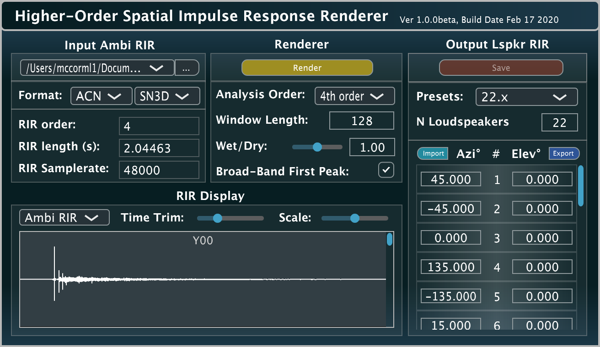

# HO-SIRR-GUI

A VST and standalone App implementation of the Higher-order Spatial Impulse Response Rendering (HO-SIRR) method [1,2]. Developed using [JUCE](https://github.com/WeAreROLI/JUCE/) and the [Spatial_Audio_Framework](https://github.com/leomccormack/Spatial_Audio_Framework).

HO-SIRR can synthesise output loudspeaker array room impulse responses (RIRs) using input spherical harmonic (Ambisonic/B-Format) RIRs of arbitrary order. The method makes assumptions regarding the composition of the sound-field and extracts spatial parameters over time, which allows it to map the input to the output in an adaptive and more informed manner; when compared to linear methods such as Ambisonics. The idea is that you then convolve a monophonic source with this loudspeaker array RIR, and it will be reproduced and exhibit all of the spatial characteristics of the captured space.



* [1] McCormack, L., Pulkki, V., Politis, A., Scheuregger, O. and Marschall, M. 2020. [**Higher-Order Spatial Impulse Response Rendering: Investigating the Perceived Effects of Spherical Order, Dedicated Diffuse Rendering, and Frequency Resolution**](docs/mccormack2020higher.pdf). Journal of the Audio Engineering Society, 68(5), pp.338-354.
* [2] McCormack, L., Politis, A., Scheuregger, O., and Pulkki, V. 2019. [**Higher-order processing of spatial impulse responses**](docs/mccormack2019higher.pdf). In Proceedings of the 23rd International Congress on Acoustics, 9--13 September 2019 in Aachen, Germany.

## Pre-built plug-in and App

The plug-in and App may be downloaded from [here](http://research.spa.aalto.fi/projects/sparta_vsts/) [Mac OSX (10.10 or higher), Linux (x86_64), and Windows (64-bit)].

## Building the plug-in and App yourself

First clone the repository (including submodules) with:

```
git clone --recursive https://github.com/leomccormack/HO-SIRR-GUI
# or if you have already cloned the repository, update with
git submodule update --init --recursive
```

## Prerequisites 

The [VST2_SDK](https://web.archive.org/web/20181016150224/https://download.steinberg.net/sdk_downloads/vstsdk3610_11_06_2018_build_37.zip) should be placed in the 'SDKs' folder like so:
```
SDKs/VST2_SDK
```

**MacOSX, Linux and Windows (x86_64/amd64)** users must install a custom Intel MKL library. Detailed instructions on how to do this can be found [here](https://github.com/leomccormack/Spatial_Audio_Framework/blob/master/dependencies/PERFORMANCE_LIBRARY_INSTRUCTIONS.md). 

**Raspberry Pi (ARM)** users instead require OpenBLAS and LAPACKE libraries:
``` 
sudo apt-get install liblapack3 liblapack-dev libopenblas-base libopenblas-dev liblapacke-dev
```

**Linux (x86_64/amd64 and ARM)** users must also install the following libraries:

```
sudo apt-get install x11proto-xinerama-dev libwebkit2gtk-4.0-dev libgtk-3-dev x11proto-xext-dev libcurl4-openssl-dev libasound2-dev
```

## Building the plug-in via CMake 

The plug-in and App may be built with CMake (version 3.15 or higher):
 ```
 mkdir build
 cmake -S . -B build
 cd build
 make
 ```
 
Or for Visual Studio users (using x64 Native Tools Command Prompt as **administrator**):
```
cmake -S . -B build -G "Visual Studio 15 Win64"
cd build
msbuild ALL_BUILD.vcxproj /p:Configuration=Release /m
```
Note: when installing CMake on Windows, make sure to allow the intaller to add CMake to the system PATH list or it won't be found.


## Building the plug-in and App without CMake

You may also manually open the .jucer file with the Projucer App and click "Save Project". This will generate Visual Studio (2015/2017) solution files, Xcode project files, Linux Makefiles (amd64), and Raspberry Pi Linux Makefiles (ARM), which are placed in:

```
audio_plugin/_HOSIRR_/make/
```

To generate project files for other IDEs, you may open and configure the included .jucer files accordingly.

## Contributors

* **Leo McCormack** - C/C++ programmer and algorithm design (contact: leo.mccormack(at)aalto.fi)
* **Archontis Politis** - algorithm design
* **Ville Pulkki** - algorithm design

## License

This project is licensed under the GPLv3 License - see the [LICENSE](LICENSE) file for details
